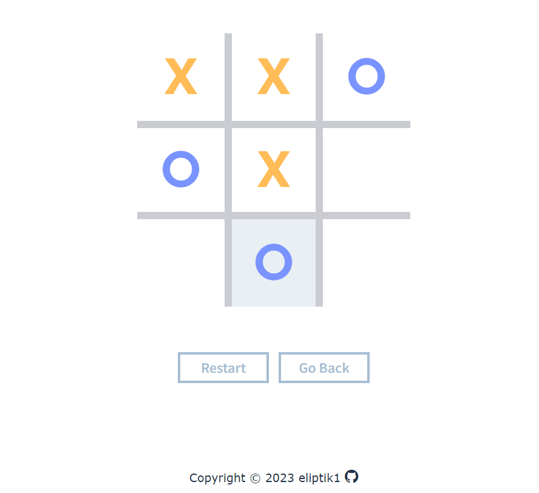
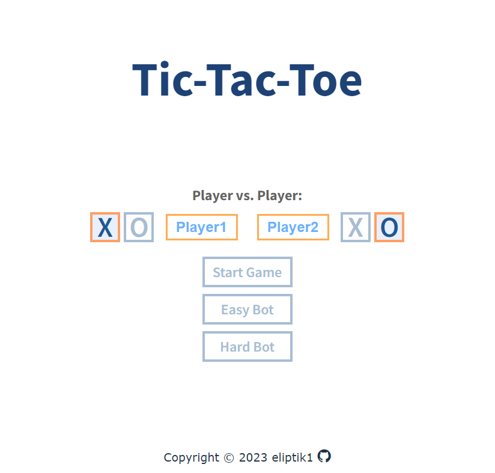

# Tic-Tac-Toe

This is a basic tic-tac-toe game created using HTML and CSS and JavaScript, featuring an AI opponent powered by the minimax algorithm.

## Technologies Used

- HTML
- CSS
- Javascript
- Git

## Features

- **Unbeatable AI:** Challenge yourself against an AI opponent that utilizes the powerful minimax algorithm to make strategic moves.

- **Two-Player Mode:** Play against a friend in the traditional two-player mode for a fun and interactive experience.

- **Simple User Interface:** Enjoy a straightforward and user-friendly design, making it easy to play and navigate.

## Demo

Check out the live demo: [Tic-Tac-Toe Demo](https://eliptik1.github.io/tic-tac-toe/)

## Screenshots

## License

This project is open-source and available under the MIT License.
